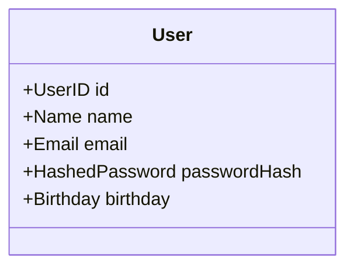
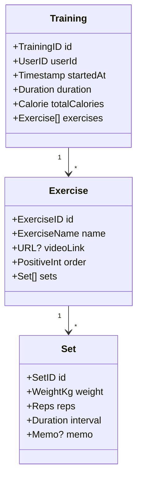
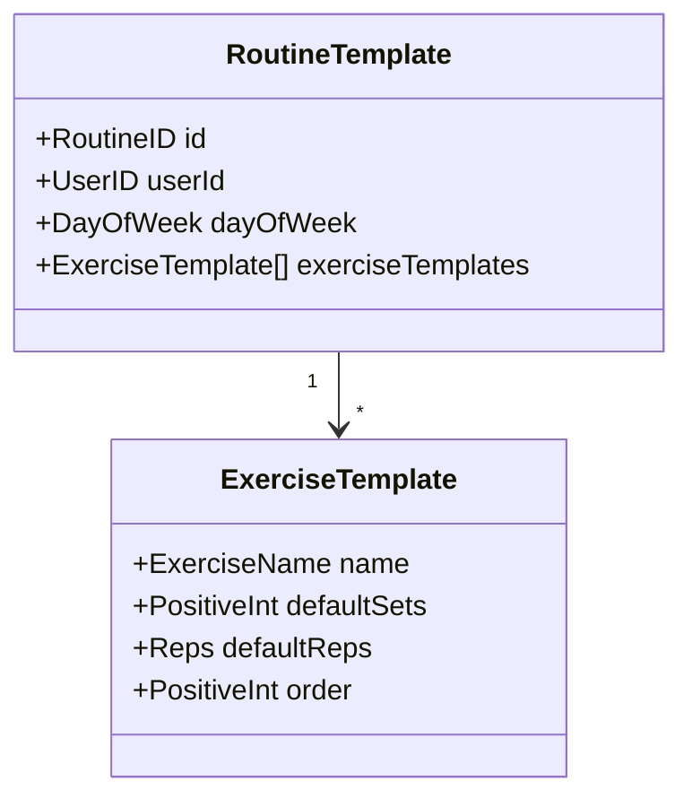
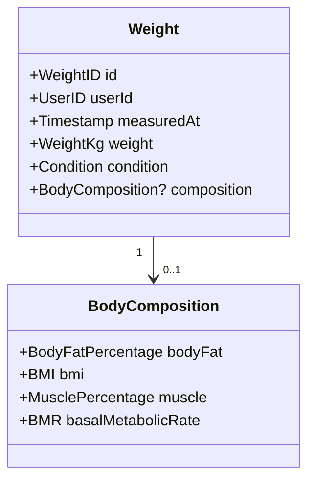
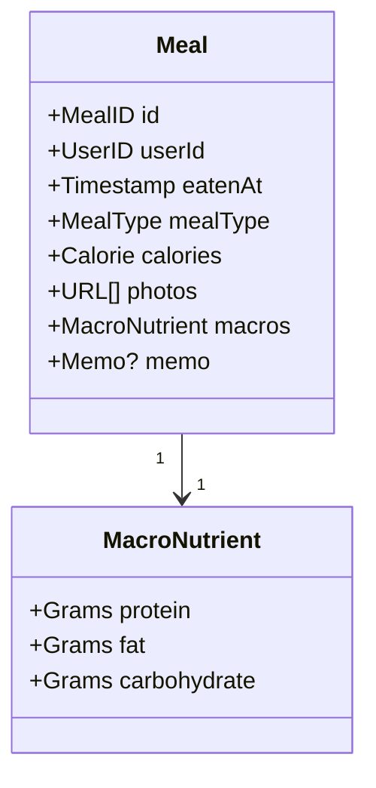

---
tags:
  - 自作アプリ
  - ドメインモデル
  - DDD
created: 2026-05-23
updated: 2026-05-23
---

# 🧩 ドメインモデル

> 食事・トレーニング・体重 一元管理アプリのドメインモデル定義

---

# 📦 Bounded Context

| Context      | 集約ルート                      | 役割                  |
| ------------ | -------------------------- | ------------------- |
| **User**     | User                       | 認証・プロフィール           |
| **Training** | Training / RoutineTemplate | トレーニングセッション + ルーティン |
| **Weight**   | Weight                     | 体重・体組成記録            |
| **Meal**     | Meal                       | 食事記録                |

---

# 👤 User Context



---

# 💪 Training Context





→ Training セッション開始時に RoutineTemplate を呼び出して初期値を埋める

---

# ⚖️ Weight Context



→ 体重だけの日 / 体組成計使う日 を両方扱える

---

# 🍽️ Meal Context



→ MealType は string ベース(ユーザーカスタム値OK)

---

# 🧱 値オブジェクト一覧

## ID系(`PrimaryIdBase` 埋め込み)

| 型            | 用途              |
| ------------ | --------------- |
| `UserID`     | User            |
| `MealID`     | Meal            |
| `TrainingID` | Training        |
| `ExerciseID` | Exercise        |
| `SetID`      | Set             |
| `RoutineID`  | RoutineTemplate |
| `WeightID`   | Weight          |

## 文字列系(`LiteralBase[string]` 埋め込み + 長さバリデーション)

| 型 | 制約 | 用途 |
|---|---|---|
| `String20` | 1-20文字、 改行NG | MealType など |
| `String50` | 1-50文字 | Name など |
| `String100` | 1-100文字 | ExerciseName / Condition |
| `String1000` | 0-1000文字 | Memo |

## 特殊文字列(個別バリデーション)

| 型 | 制約 |
|---|---|
| `Email` | Email形式 |
| `URL` | URL形式 |
| `HashedPassword` | bcrypt形式 |

## 数値系(`LiteralBase` 埋め込み)

| 型 | ベース | 制約 | 用途 |
|---|---|---|---|
| `NonNegativeInt` | int | 0以上 | Calorie / BMR / order / カウント系 |
| `NonNegativeDecimal` | decimal | 0以上 | Grams(P/F/C 共用) |
| `Reps` | int | 1以上 | セット回数 |
| `WeightKg` | decimal | 0より大、 1000未満 | 重量 |
| `Percentage` | decimal | 0-100 | BodyFat / BMI / Muscle 共用 |

## 標準型をそのまま使う

| 型 | 用途 |
|---|---|
| `time.Time` | Timestamp / Birthday / MeasuredAt / EatenAt |
| `time.Duration` | セッション時間 / セット間 interval |
| `DayOfWeek` | enum (月-日) |

---

# 📐 実装パターン

## 共通基底

```go
// value_object/literal_base.go
type LiteralBase[T any] struct {
    v T
}

// value_object/primary_id_base.go
type PrimaryIdBase struct {
    LiteralBase[string]  // UUID格納
}
```

## ID(`~struct { PrimaryIdBase }` 制約)

```go
package value_object

type PrimaryId interface {
    ~struct{ PrimaryIdBase }
}

type UserID struct        { PrimaryIdBase }
type MealID struct        { PrimaryIdBase }
type TrainingID struct    { PrimaryIdBase }
type ExerciseID struct    { PrimaryIdBase }
type SetID struct         { PrimaryIdBase }
type RoutineID struct     { PrimaryIdBase }
type WeightID struct      { PrimaryIdBase }

func NewPrimaryId[T PrimaryId]() T {
    return T{PrimaryIdBase: newPrimaryIdBase()}
}

func NewPrimaryIdFromString[T PrimaryId](s string) (*T, error) {
    p, err := newPrimaryIdBaseFromString(s)
    if err != nil {
        return nil, err
    }
    return &T{PrimaryIdBase: p}, nil
}
```

使い方:
```go
id := value_object.NewPrimaryId[value_object.UserID]()
id, err := value_object.NewPrimaryIdFromString[value_object.UserID](s)
```

## 文字列VO(コンストラクタ強制)

```go
package value_object

import validation "github.com/go-ozzo/ozzo-validation/v4"

type String50 struct {
    LiteralBase[string]
}

func (s String50) Validate() error {
    return validation.Validate(s.v,
        validation.Required,
        validation.RuneLength(1, 50),
    )
}

func NewString50(s string) (*String50, error) {
    v := String50{LiteralBase: LiteralBase[string]{v: s}}
    if err := v.Validate(); err != nil {
        return nil, err
    }
    return &v, nil
}

// 50文字でカットして末尾"..."
func NewString50WithCut50(s string) String50 {
    if len(s) > 50 {
        return String50{LiteralBase: LiteralBase[string]{v: s[:47] + "..."}}
    }
    return String50{LiteralBase: LiteralBase[string]{v: s}}
}
```

## 数値VO(同パターン)

```go
type Reps struct {
    LiteralBase[int]
}

func (r Reps) Validate() error {
    return validation.Validate(r.v, validation.Min(1))
}

func NewReps(v int) (*Reps, error) {
    r := Reps{LiteralBase: LiteralBase[int]{v: v}}
    if err := r.Validate(); err != nil {
        return nil, err
    }
    return &r, nil
}
```

---

# 🚧 実装スコープ

## Week 1-2(MVP)
- **User + Meal** を実装(2集約のみ)

## Week 3
- Training + RoutineTemplate
- Weight + BodyComposition

## 将来(入社後)
- 食事画像 → AI でカロリー自動算出(非同期処理)
- ルーティン自動提案
